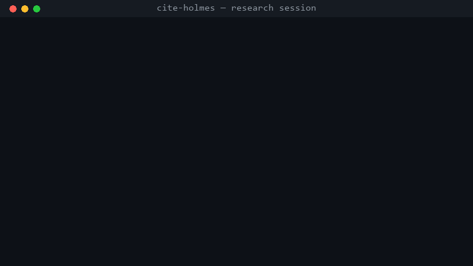

# Cite Holmes 🔍

**Deep research that interrogates its own sources.**

Every AI research report you've ever read had a dirty secret: some of those polished references were probably fabricated. [Nature estimates tens of thousands of 2025 papers contain invalid AI-generated references](https://www.nature.com/articles/d41586-026-00969-z). [NeurIPS 2025 accepted papers were scanned: 100+ hallucinated citations slipped through peer review](https://medium.com/@ljingshan6/100-fake-citations-just-slipped-through-neurips-2025-peer-review-5f34f4436560).

Cite Holmes is a deep-research skill with a badge and a magnifying glass: it researches like any deep-research agent — then **arrests its own citations before you can cite them**.



*(Demo is real output: 8 references, 3 deliberately planted fabrications — a fake DOI, a dead URL, and a no-URL citation. All 3 were caught and excluded.)*

## How it works

Five phases, two modes:

| Phase | What happens |
|---|---|
| **CALIBRATE** | Asks you 3–5 sharp questions first (scope, timeframe, audience) — prevents researching the wrong question |
| **PLAN** | Breaks your question into 3–7 sub-questions with a search budget |
| **SEARCH** | Diamond-shaped iterative search: broad → narrow → gap-filling, Chinese + English, source-tier pyramid |
| **VERIFY** | Two layers: semantic check (does the source actually support the claim?) + mechanical check (reachability, domain authority, field completeness, dedup) |
| **SYNTHESIZE** | Report where every conclusion carries a confidence grade — 🟢 two independent sources / 🟡 single authority / 🔴 contested |

Modes: **QUICK** (single fact-check, ≤6 searches, no interrogation) vs **FULL** (open-ended research, ≤15 searches, calibration mandatory).

## The five citation verdicts

| Verdict | Meaning |
|---|---|
| `verified` | Reachable + authoritative tier (official/journal/preprint/major media) + complete fields — may support conclusions |
| `partial` | Reachable but community/blog tier or missing fields — downgraded use |
| `unreachable` | 404/timeout (≠ nonexistent — flagged for human review) |
| `invalid` | Malformed or missing URL/DOI — never enters the report |
| `unverified` | Not checked — never masquerades as verified |

## Install

**OpenClaw users (ClawHub — versioned, auto-updatable):**

```bash
clawhub search cite-holmes        # find it on the registry
clawhub install @docsor1212/cite-holmes
```

**Any Agent Skills-compatible agent** (Claude Code, Codex, Cursor, Gemini CLI, ZCode):

```bash
git clone https://github.com/docsor1212/cite-holmes.git ~/.claude/skills/cite-holmes
```

**China mirror (SkillHub 腾讯)**: <https://skillhub.cn/skills/cite-holmes> — fast downloads inside China, 中文说明.

## Usage

Just talk to your agent — it triggers automatically:

```
> deep research: what changed in the agent-skills ecosystem this year?
> is it true that NeurIPS 2025 papers contained 100+ hallucinated citations?
```

Or use the verifier standalone on any reference list:

```bash
python scripts/verify_refs.py --refs research_refs.json --out report.md
# offline structural check / strict CI mode
python scripts/verify_refs.py --refs refs.json --offline
python scripts/verify_refs.py --refs refs.json --strict
```

## Why not just use deep research / a citation checker?

- Deep-research skills **research more** but trust their own citations.
- Standalone citation checkers verify but don't research.
- Cite Holmes does both in one flow: **every reference in every report is machine-checked before it reaches you.**

Zero dependencies (pure Python stdlib), cross-platform (Windows/Linux/macOS), MIT license.

## License

MIT © DoctorQ Lab
